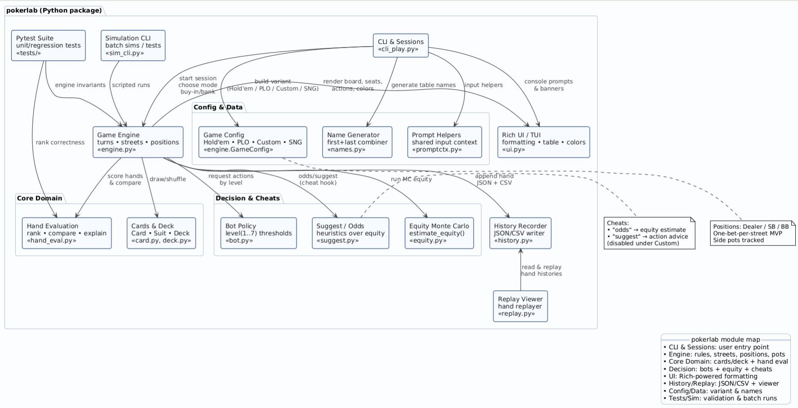

# pokerlab
## Author: Saidou Diallo
## LinkedIn: https://www.linkedin.com/in/saidoudialloquant/
### PROGRAMS USED
Tableau • Git Bash • Eclipse • GitHub • PlantUML • VS Code
### LANGUAGES USED
Python • Bash • Markdown • UML  
### SKILLS USED
Monte Carlo Simulation • Reinforcement Learning • Statistical Modeling • Software Architecture • Data Visualization • Automated Testing • CLI/UX Design
## SUMMARY
A full Monte Carlo–driven poker simulation engine that models decision logic, multi-bot play, and session statistics through a Rich-powered command-line interface. It supports Texas Hold’em, Pot-Limit Omaha, Custom tables, and Sit-n-Go tournaments with replay and hand-history export (JSON/CSV). I named it pokerlab because It’s a “laboratory” for quantitative experimentation — much like bsopt (Black-Scholes Options), it’s built for testing, optimizing, and analyzing probabilistic systems. It is for Quant researchers, poker AI developers, and anyone building models that require risk, equity, or policy simulation in stochastic environments.Existing poker frameworks are either GUI-heavy or limited to fixed hands; this provides a modular simulation kernel with reproducible analytics, hand histories, and explainable decisions — ideal for backtesting strategies or AI training. It combines domain-specific Monte Carlo equity modeling, configurable agent levels (1–7 skill tiers), side-pot tracking, and a fully traceable Rich CLI interface — something you don’t get from “just using a poker odds library.”
## VALUE PROPOSITION
A research-grade poker engine designed for simulation, experimentation, and decision analysis. pokerlab transforms probabilistic gaming into a quant-ready testing environment.
## ARCHITECTURE DIAGRAM

## QUICKSTART (GIT BASH)
### STEP 1 —  Clone the repository
git clone https://github.com/smdiallo_ncstate/pokerlab.git
cd pokerlab
### STEP 2 — Set up the Python environment
python -m venv .venv
source .venv/Scripts/activate
pip install -r requirements.txt
### STEP 3 — Run the CLI game
python -m poker.cli_play
# Modeling & Methods
Implements Monte Carlo simulations for hand equity estimation, policy heuristics (“suggest”), and odds computation. Modular bot logic scales from casual (Level 1) to professional (Level 7) players. Includes random name generation and seat rotation logic for realism.
# Engineering & Performance
Developed with pytest test coverage, version-controlled in GitHub with proper CI readiness. Includes Rich-formatted TUI, JSON/CSV persistence, and replay capabilities. The engine is modular and optimized for iterative simulation testing, with deterministic random seeds for reproducibility.
# Features
- Multi-variant support: Texas Hold’em, PLO, Custom, Sit-n-Go
- Rotating Dealer/SB/BB, side-pot tracking, replay viewer
- Real-time cheats (odds, suggest) and Monte Carlo odds display
- Statistical summaries (VPIP, PFR, profit graphs, top pots)
- Hand explanations, game history logging, and expandable bot API
